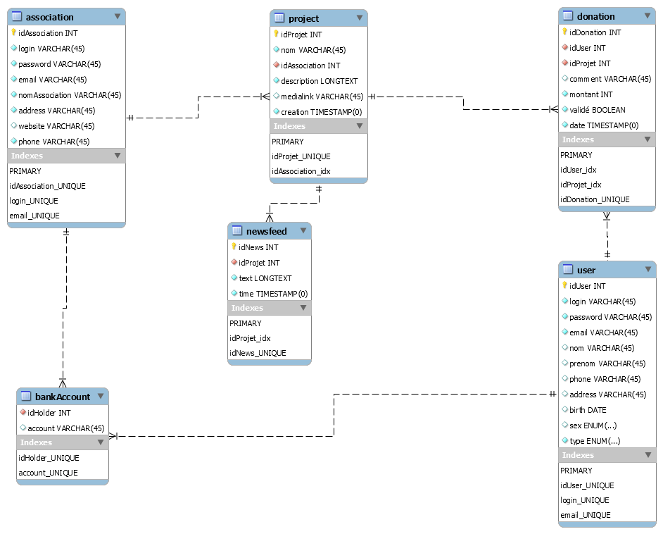

% Etude préliminaire du projet Greenlight
% Guillaume JOOP - Gregory RIPOLL
% 09/08/2016

# Project definition

## Project brief

* Objectif global : l'objectif du projet est de concevoir une plate-forme de
financement participatif permettant a des associations caritatives de proposer
un espace de dons en ligne
* Objectif spécifique à l'utilisateur enregistré :
    + Administrateurs :
        - Valider les demandes d'associations aprés vérification de projet
non frauduleux
        - Valider les promesses aprés vérification de don non farfelu
        - Elire modérateur
    + Modérateurs :
        - Modérer les différentes pages de dons (newsfeed, description, etc)
    + Associations :
        - Mettre en ligne son espace de dons et de le gérer
        - Communiquer sur l'avancement de son projet a travers un "newsfeed"
        - Visualiser les différentes promesses de dons effectués
        - Visualiser les dons déjà enregistrés ainsi que différentes
statistiques (montant/mois, montant moyen/donation, etc...)
    + Particuliers :
        - Enregister des infos personelles réutilisable pour de futurs dons
        - Visualiser les promesses de dons effectuées
        - Postuler en tant que modérateur
* Objectif spécifique à l'utilisateur non-enregistré :
    + Effectuer une promesse de don de manière simple et efficace
    + Pouvoir s'enregister (association ou particulier)

## Personas

Le site est avant tout destiné aux associations carritative souhaitant proposé
un espace de dons en ligne, mais aussi ouvert au grand public afin
d'effectuer ces dons.

\pagebreak

## Initial Tech Specs

* Navigateur : Mozilla Firefox, Google Chrome, Microsoft Edge (compatibilité
Universal Windows Platform espéré)
* Langage de programmation : HTML5, PHP 5.6, CSS3, javascript, SQL, markdown
* Logiciels utilisés : NetBeans pour le développement web et le versioning,
xampp pour le déploiement sur serveur et la base de données, pandoc pour la
conversion du markdown en pdf, MySQL Workbench pour la création du schéma
entité/association, WireframeSketcher (version d'essai) pour le wireframe du
site
* Résolution : utilisation uniquement "desktop" pour commencer, optimisé pour
des résolutions allant du 800x600 au 1920x1080, au format 4:3 5:4 16:10 et 16:9
(autre résolutions et formats impossible a tester faute de matériel)

## Project Timeline

* Début du projet crowdfunding : 26/07/2016
* Echéance étude préliminaire : 10/08/2016
* Echéance projet crowdfunding : 20/09/2016
* Temps total : 8 semaines
* Temps étude préliminaire : 2 semaines
* Temps projet : 6 semaines

| Période                                       | Tâche                                                                 |
|-----------------------------------------------|-----------------------------------------------------------------------|
| Semaines 1 & 2 (du 26 /07/2016 au 09/08/2016) | Rédaction de l'étude préliminaire ; Mise en place du dépôt GitHub.    |
| Semaine 3 (du 10/08/2016 au 16/08/2016)       | Création de la base de données.                                       |
| Semaine 4 (du 17/08/2016 au 22/08/2016)       | Page d'accueil, d'inscription et de connexion.                        |
| Semaine 5 (du 23/08/2016 au 29/08/2016)       | Page de projet et de don ; CSS.                                       |
| Semaine 6 (du 30/08/2016 au 05/09/2016)       | Version utilisateur des pages ; CSS.                                  |
| Semaine 7 (du 06/09/2016 au 12/09/2016)       | Espace administrateur/modérateur ; Test et ajout de fonctionnalitées. |
| Semaine 8 (du 13/09/2016 au 19/09/2016)       | Test final ; Rédaction du rapport et préparation oral.                |

# Site Structure

## Content/Functionality Outline

* Page d'accueil :
    + Accés à la base de données
    + Connexion
    + Lien vers page d'inscription
    + FAQ
    + Nous contacter
    + Projet à la une
    + Projets récents
    + Projets populaires
* Page d'inscription :
    + Accés à la base de données
    + FAQ
    + Nous contacter
    + Formulaire :
        - Association :
            + login
            + password
            + e-mail
            + Nom d'association
            + Numéro d'association
            + Adresse
            + Numéro de téléphone
            + Site web (facultatif)
            + Données bancaires
        - Particulier :
            + login
            + password
            + email
            + Nom (facultatif)
            + Prénom (facultatif)
            + Numéro de téléphone (facultatif)
            + Adresse (facultatif)
            + Date de naissance (facultatif)
            + Sexe (facultatif)
            + Données bancaires
* Page de projet :
    + Accés à la base de données
    + Connexion
    + Lien vers page d'inscription
    + FAQ
    + Nous contacter
    + Un projet sera composé de :
        - Un nom
        - L'association créatrice
        - Une image/une vidéo de présentation
        - Une description
        - La date de mise en ligne
        - La somme acquise
        - Deux flux en temps réel :
            * Un "newsfeed" alimenté par l'association
            * Les promesses de dons effectués accompagné du nom d'utilisateur si
identifié et d'un commentaire facultatif
    + Les autres projets de l'association et/ou les projets similaires
* Page de dons :
    + Accés à la base de données
    + Connexion
    + Lien vers page d'inscription
    + FAQ
    + Nous contacter
    + Formulaire :
        - email
        - montant du don
        - données bancaires
        - pseudo (facultatif)
        - commentaire court (facultatif)

\pagebreak

## Database Diagram

Remarque : La table bankAccount est a protéger car elle contiendra des infos
trés sensible. Peut être à placé dans une base à part. Recherche sur la
sécurisation et le cryptage des données a faire. De plus la double liaison
à 'idAssociation' ET 'idUser' peut poser des problèmes de requêtes...

Dans la table 'donation', le champ 'validé' est un booléen indiquant si la
promesse de dons a été tenue

#Visual design

Les couleurs choisies sont le vert, le bleu et des nuances de gris. Le choix du logo
s'est porté sur un feu tricolore dont le vert est illuminé (référence à "greenlight",
feu vert en anglais). le squelette général est déjà défini mais amené a évolué.
L'identité visuel final du site n'est pas clairement défini.

## Advanced wireframe

Plusieurs catégories, dons possible dès la page d'accueil. Footer non défini.

\pagebreak

Simple page a deux boutons (chacun redirigeant vers le formulaire correspondant).

\pagebreak

Formulaire pour une association. Vérification de champs non-vides sur login, email, 
address, phone, nomAssociation et bankAccount. Vérification de la force du password.

\pagebreak

Formulaire pour un particulier. Vérification de champs non-vides sur login, email et bankAccount. 
Vérification de la force du password.

\pagebreak

Possibilité laissé à l'utilisateur de laisser un bref commentaire (< 100 caractères) avec son don

